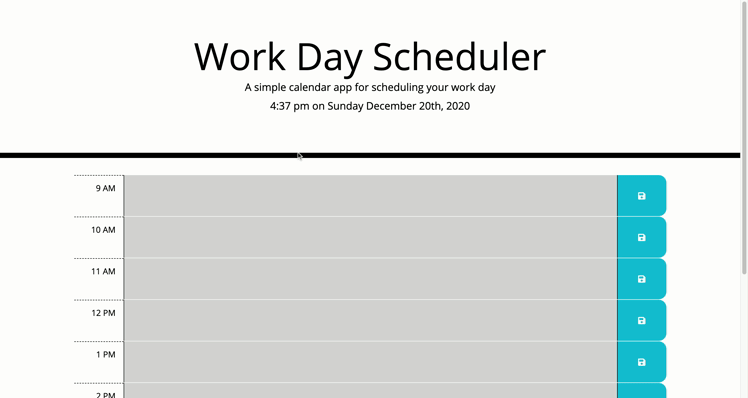

# Day Planner

## Table of Contents
* [Deployed Application](#deployed-application)
* [Project Goals](#project-goals)
* [Features](#features)
* [Design Notes](#design-notes)
* [Technologies](#technologies)
* [Live Demo](#live-demo)
* [License](#license)

## Deployed Application
The deployed application can be viewed at the link below.

[Day Planner - Live Demo](https://jxhnkndl.github.io/day-planner)

## Project Goals

The goal of this project was to create a day planner application covering business hours between 9 AM and 5 PM. Upon startup, the application displays the current time and date to the user and paint the background of each hour block in the user interface based on the current time. Using the browser, each block can be used to input and save events to local storage that will persist in the user interface on page refresh. The application validates all attempts to save an entry to local storage to prevent empty and duplicate entries from being saved. The application is also capable of handling updated and deleted entries.

## Features

* **Current Date and Time:** Upon startup or refresh, the application retrieves, formats, and displays the current date and time in the application's header.

* **Dynamically Powered Hour Blocks:** Also upon startup or refresh, the application uses Moment.js, jQuery, and JavaScript to dynamically render time blocks for each of the hours between 9 AM and 5 PM. Using the current time provided by Moment.js, the application paints past hour blocks in gray, future hour blocks in green, and the current hour red, given that the current hour falls within the hours covered by the application.

* **Events Persist in the Browser:** When a user enters a new event on a particular hour and clicks the save button, the application pushes that data to local storage so that if the user refreshes or closes and reopens the application, the state of the application and the user interface reloads exactly as the user left them.

* **Detailed Input Validation:** Before saving a user's entry to local storage in the browser, the application parses and validates the input. The application contains logic for validating and handling new entries, duplicate entries, empty entries, updated entries, and deleted entries. 

## Design Notes

On this project, I saw an opportunity to embrace a challenge and add more complex logic for validating user inputs before saving it to local storage. On the surface, the visible functionality of the application is for a user to input event, save the event, and let the application store that event in local storage so that the data persists in the user interface even after a page refresh or closing and reopening the browser. As cool as that is, what's happening under the hood is even cooler. 

The application is designed to handle several input validation situations. If the application detects that the user's input is either empty or a duplicate entry that already exists, the application does not save the entry local storage. In the event that the user updated an existing entry, the application detects this and saves the new, updated entry in place of the old entry. Additionally, if the user removes an existing saved event from the user interface by deleted the text and saving, the application interprets this as the deletion of an event and removes it from local storage as well. In all of these more advanced validation scenarios, the application also prints a short message to the console documenting its actions.

Lastly, all of the hour blocks within the user interface are dynamically generated and injected into the HTML document using jQuery and JavaScript. This makes the application scalable in the sense that retooling it to cover a larger or smaller amount of time can easily be accomplished by changing a few lines of JavaScript.

## Technologies
* HTML
* CSS
* Bootstrap 4
* JavaScript
* jQuery
* Moment.js

## Live Demo

## License

MIT @ [J.K. Royston](https://github.com/jxhnkndl)